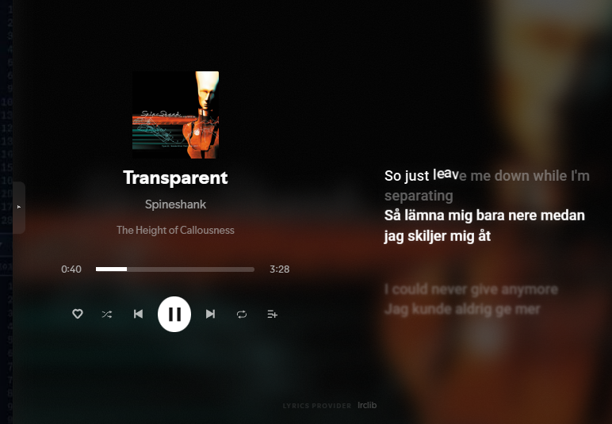

<h1 align="center">ivlyrics-sidecar</h1>

<p align="center"><b>Your library, your queue and your lyrics on one fullscreen. No more bouncing back to Spotify.</b></p>

<p align="center">
  
</p>

ivLyrics has a beautiful fullscreen mode, but you can't do much from it. To pick a playlist, see what's next or look at an album, you have to leave fullscreen and go back to the normal Spotify window. **ivlyrics-sidecar** adds the missing panels on top of ivLyrics, and removes the parts that get in the way.

- **⌥ Alt+L: your library.** Playlists open in place, newest tracks first. Browse freely: nothing interrupts the song until you double-click. Tap **q** to play a track next, and **back..** returns to what's playing. Search starts in the playlist you're in and widens to everything when you ask.
- **⌥ Alt+R: what's around this song.** Previous tracks, the queue and autoplay picks. It folds away like a book cover and opens by itself when a song has no lyrics.
- **Click the album, title or artist** to open the album or the artist's releases right there, instead of leaving fullscreen.
- **Right-click the cover** to show the album or artist, or add the song to one of your playlists.
- **Lyrics sync in two clicks.** A faint gear next to the lyrics nudges them earlier or later for the current song.
- **No accidents.** Clicking a lyric line no longer jumps the song, and the window buttons only appear when you rest the mouse in the corner.
- **A playlist home page.** Spotify opens on your playlists; one click plays a playlist and drops you straight into fullscreen.

| Library pane | Lyrics, tightened |
|---|---|
|  |  |

<details><summary>Before: the stock ivLyrics fullscreen</summary>


</details>

## Install in one line

Open **PowerShell as your normal user (not "Run as administrator")** and paste:

```powershell
irm https://raw.githubusercontent.com/gigacook/ivlyrics-sidecar/main/install.ps1 | iex
```

Spotify restarts. Open ivLyrics, go fullscreen, and press **Alt+L** or **Alt+R**.

---

## Manual

- [Key terms](#key-terms)
- [Requirements](#requirements)
- [Installing](#installing)
- [Everyday use](#everyday-use)
- [Keys](#keys)
- [How it decides things](#how-it-decides-things)
- [Recommended ivLyrics settings](#recommended-ivlyrics-settings)
- [Updating and removing](#updating-and-removing)
- [Troubleshooting](#troubleshooting)
- [Reference](#reference)

### Key terms

- **Spicetify** is a tool that modifies the Spotify desktop app so it can load extra code. Everything here runs through it.
- **ivLyrics** is a Spicetify custom app that shows synced lyrics and has its own fullscreen mode. ivlyrics-sidecar only works on top of it.
- **Extension** means a script Spicetify loads into every Spotify page. `ivlyrics-sidecar.js` is one.
- **Custom app** means a page Spicetify adds to Spotify with its own icon in the top bar. `playlist-home` is one.
- **`spicetify apply`** writes your extensions and apps into Spotify and restarts it. Any change needs it.
- **Library pane** is the panel that slides out on the left (Alt+L). Everything ivlyrics-sidecar draws uses the JetBrains Mono font if it's installed, and Consolas otherwise.
- **Queue pane** is the panel on the right, where the lyrics normally are (Alt+R).

### Requirements

| You need | How to check |
|---|---|
| Spotify desktop app for Windows | It's installed and you can log in. |
| Spicetify | `spicetify -v` in PowerShell prints a version number. If it doesn't, install it from [spicetify.app](https://spicetify.app). |
| ivLyrics, installed through Spicetify | It has an icon in Spotify's top bar, and `spicetify config custom_apps` lists `ivLyrics`. |

Built and used with Spotify 1.3.3, Spicetify 2.45 and ivLyrics 6.6. Other versions will probably work, but internal Spotify queries can change between releases (see [Troubleshooting](#troubleshooting)).

### Installing

The one-line installer above does the following. To do it by hand from a downloaded copy of this repository, run `.\install.ps1` from the repository folder, or follow these steps:

1. Copy `extension\ivlyrics-sidecar.js` into `%APPDATA%\spicetify\Extensions\`.
2. Copy the `apps\playlist-home` folder into `%APPDATA%\spicetify\CustomApps\`.
3. Register both with Spicetify:
   ```powershell
   spicetify config extensions ivlyrics-sidecar.js
   spicetify config custom_apps playlist-home
   ```
4. Run `spicetify apply` from a normal PowerShell window. Spotify closes and opens again.
5. Check it worked: Spotify opens on a grid of your playlists, and in ivLyrics fullscreen a small tab sits in the middle of the left edge.

The installer refuses to run from an administrator window, because Spicetify files written by an administrator can leave Spotify showing a black window. It also stops if ivLyrics isn't installed.

### Everyday use

**Start from your playlists.** Spotify opens on the Playlists page: your playlists and Liked Songs, grouped by folder, with a filter box at the top. Click one: it starts playing, ivLyrics goes fullscreen and the library pane is already open. When you leave fullscreen, you're back on the Playlists page. In windows 720 pixels tall or less, the page shows names only.

**Browse your library (Alt+L).** The pane slides out from the left, and the cursor goes straight into its search box and stays there, so you can type or use the arrow keys without clicking first. The library and queue panes are always the same width (the average of a 300-pixel pane and half the window) and share the same see-through dark background. In wide windows (1100 pixels or more) it pushes the fullscreen over; in narrower ones it floats on top. Its top row shows where you are as a path, for example `/all/techno/dj`. Names too long for the pane are shortened in the middle, so both ends stay readable: `techno-hardgroove` can become `tech…oove`, and parent folders lose their vowels (`techno` becomes `tchn`) or fold into `…` before the current name is cut. Hover the path to see it in full.
- Click a playlist or Liked Songs to open it in the pane. Each track is one line, "Artist – Song", with the date it was added, newest first.
- Browsing never changes what's playing. A single click on a track only selects it. Double-click a track to play that playlist from there.
- To hear a track next without leaving your current playlist, hover it and click the yellow **q** on the right, or select it and press Q. It goes to the front of Spotify's queue, and the queue pane (Alt+R) shows it with a yellow **u** in front.
- While you're looking at a different playlist than the one playing, a **back..** button sits at the top right. It opens the playing playlist and highlights the current track.
- Click a folder to open it. Albums and artists in your library play when clicked.
- Backspace or Esc goes up one level. At the top level, they close the pane.

**Search.** Type in the box at the top of the library pane. Search starts in what you're looking at and only widens when you ask:
1. Inside a playlist, it searches that playlist. Inside a folder, it searches that folder.
2. With no matches, the list says `No matches in <name>. Search all playlists? Y ↵`. Press Y or Enter, or click it, to search every playlist name and every song in every playlist. Each song shows which playlist it's in. The first time, this loads all your playlists and shows `Searching all playlists 12/140…` while it works.
3. If that finds nothing either, the same prompt offers to search all of Spotify.

Tab widens the search at any time, even when there are matches. Esc clears the search.

**See what's around this song (Alt+R).** The queue pane replaces the lyrics column. It starts with the current song, highlighted, then lists what's next: your manually queued songs (under "Queue", each marked with a yellow `u`), the rest of the playlist, and Spotify's autoplay picks (under "Recommended", only if autoplay is on). Click a song to jump to it. A faint path above the list shows where you are, for example `/queue/faceless/engage war`. A hint below the list reminds you how to leave: `alt+r to close`, or `esc back · alt+r close` inside an album or artist.

**Move between the queue and the middle.** Press ← while you're in the queue, or left-click any empty spot in the middle of the screen, and the queue folds away. A thin blinking caret appears above the player to show the focus is now in the middle. From there, → brings the queue back and ← opens the library. Clicks on buttons, the progress bar, the cover and links keep working as usual.

**Albums and artists, without leaving fullscreen.**
- Clicking the **album name** or the **song title** under the cover opens the album in the queue pane: cover, title, artist and year, then numbered tracks with their lengths. Click a track to play the album from there.
- Clicking the **artist name** opens the artist's releases, newest first, with year and type. Open one to see its tracks.
- **Right-clicking the cover** opens a small menu: Show album, Show artist, and Add to playlist. Add to playlist shows a filter box and the playlists you can edit. Pick one, or type and press Enter for the first match, and the song is added to the end of it.

**Fix lyrics timing.** Move the mouse over the lyrics side and a faint gear appears, level with the play button. Click it to open the sync dialog:
- **◀ + earlier** shows the lyrics sooner; **− ▶ later** shows them later. The number turns blue for earlier and amber for later, the bar grows from the centre in that direction, and the number kicks left or right with each press.
- The step buttons set how far each press moves: 10, 50, 100, 250, 500 or 1000 milliseconds. Your choice is remembered.
- **reset** puts the song back to 0. The offset is saved for this song only, using ivLyrics' own per-song offset, and ivLyrics clamps it to ±10 seconds.

### Keys

All of these work in ivLyrics fullscreen only, except Space, which works everywhere in Spotify.

| Press | Where it works | What happens |
|---|---|---|
| Alt+L | Anywhere | Opens or closes the library pane and puts the cursor in its search box. |
| Space | Anywhere in Spotify, fullscreen or not | Plays or pauses. The only exception is a text box that already has text in it, where Space types a space so multi-word searches still work. |
| ↑ or ↓ | Library pane (the search box keeps the cursor) | Moves the selection through the list. The first press starts from the playing track. |
| Enter | Library pane, a row selected, search box empty | Opens the selected folder or playlist, or plays the selected track. |
| Q | Library pane, a track selected, search box empty | Puts the selected track first in the queue. With text in the box, Q just types. |
| → | Library pane, cursor at the end of the search text | Closes the library and moves the focus to the middle. |
| Alt+R | Anywhere | Opens or closes the queue pane. |
| Backspace or Esc | Library pane | Clears the search if there's text. Otherwise goes up a level, or closes the pane at the top level. Esc never exits fullscreen while the pane is open. |
| Y, Enter or Tab | Library search with no matches | Widens the search: this view, then all playlists, then Spotify. Tab works even with matches. |
| ↑ or ↓, then Enter | Library search results | Moves through the results; Enter opens or plays the highlighted one. |
| ↑ or ↓ | Queue pane, when you're not typing | Moves a highlight. The first press starts from the playing song. |
| ← | Queue pane | Folds the queue away and moves the focus to the middle, shown by a faint blinking caret above the player. |
| → | Middle (caret showing) | Opens the queue pane again. |
| ← | Middle (caret showing) | Opens the library pane with the cursor in its search box. |
| Enter | Queue pane | Plays the highlighted song, or opens the highlighted release. |
| Backspace or Esc | Queue pane, inside an album or artist | Goes up one level. |
| + or ← | Sync dialog | Moves the lyrics earlier by one step. |
| − or → | Sync dialog | Moves the lyrics later by one step. |
| 1 to 6 | Sync dialog | Picks the step size: 10, 50, 100, 250, 500 or 1000 ms. |
| 0 | Sync dialog | Resets the offset to 0. |
| Esc or Backspace | Sync dialog or right-click menu | Closes it, or in the playlist picker, goes back to the menu. |

### How it decides things

**When the queue pane opens by itself.** Checked twice a second in fullscreen:
1. If the current song has no lyrics for 0.7 seconds, the pane opens.
2. If you then close it with Alt+R, it stays closed for the rest of that song.
3. When a song with lyrics starts, the pane closes again, but only if it opened by itself. If you opened it, it stays.

**Where the player sits.**
1. The album column (cover down to the controls) is always centred vertically.
2. With no lyrics and the queue pane closed, the column slides to the horizontal centre of the screen. When the pane opens, the column slides left first and the pane unfolds behind it.
3. The queue list fills the band from 33% to 66% of the window height, or the full height of the album column if that's taller, so both sides line up.

**Which playlists "Add to playlist" offers.** Playlists you own, collaborative ones, and ones Spotify says you can add to. If it can't tell, it lists all playlists; adding to one you can't edit then fails with `Couldn't add to <name>`.

**Window buttons.** Minimise, maximise and close stay hidden. Rest the mouse in the top-right corner (the last 150 by 56 pixels) for half a second and they appear; move away and they hide.

### Recommended ivLyrics settings

[`settings/ivlyrics-settings.json`](settings/ivlyrics-settings.json) is the ivLyrics setup these screenshots use: compact two-column fullscreen, 20-pixel lyrics with a translation line below, reduced motion and a 29 fps cap. To use it, open ivLyrics settings, go to **Advanced**, then **Export/Import Settings**, click **Import** and pick the file. ivLyrics reloads the page.

The file contains no API keys. Two things to change for yourself:
- Translations target Swedish (`"translate:target-language": "sv"`). Change it in ivLyrics settings, or in the file before importing.
- Gemini is enabled as the AI provider, but without a key it does nothing. Add your own key in the **AI Providers** tab if you want AI translations.

ivlyrics-sidecar also overrides a few ivLyrics layout details no matter which settings you use:
- The current lyric line sits one third from the top, not in the middle.
- Line spacing follows the actual lyric size.
- Unsynced lyrics are smaller and packed tightly.
- The "LYRICS PROVIDER" footer under the lyrics is hidden.
- Clicking a lyric line does nothing, instead of jumping the song to that line.

### Updating and removing

- **Update:** run the install line again. It overwrites both files and runs `spicetify apply`.
- **After a Spotify update:** Spotify updates wipe Spicetify changes. Run `spicetify backup apply` (Spicetify's own fix), then the install line again if the panels are gone.
- **Remove:** run `.\uninstall.ps1` from the repository, or by hand: `spicetify config extensions ivlyrics-sidecar.js-` and `spicetify config custom_apps playlist-home-` (the trailing `-` removes the entry), then `spicetify apply`. ivLyrics itself is never modified.

### Troubleshooting

**`Run this from a normal (non-administrator) PowerShell window.`**
The installer was started from an administrator window. Open PowerShell from the Start menu without "Run as administrator" and run it again.

**`Spicetify not found. Install it first: https://spicetify.app`**
`spicetify` isn't on your PATH. Install Spicetify, close and reopen PowerShell, and check that `spicetify -v` works.

**`ivLyrics is not installed as a Spicetify custom app. ivlyrics-sidecar needs it.`**
Install ivLyrics, for example from the Spicetify Marketplace, then run the installer again.

**Spotify shows a black or blank window after installing.**
`spicetify apply` ran as administrator at some point. Run `spicetify restore`, then `spicetify backup apply` from a normal window, then the installer again.

**Alt+L or Alt+R does nothing.**
They only work in ivLyrics fullscreen. If they still do nothing there, the extension isn't loaded: check that `spicetify config extensions` lists `ivlyrics-sidecar.js`, and run `spicetify apply`.

**`Couldn't load this album.` or `Couldn't load this artist.`**
These use internal Spotify queries that can change with Spotify updates. Open Spotify's own album or artist page once and try again. If it keeps failing, open an issue with your Spotify version.

**Spotify-wide search shows `No matches anywhere.` for something that exists.**
The search query definition loads with Spotify's Search page. Open the Search page once, then try again.

**`Couldn't add to <playlist>`**
You can't edit that playlist (it belongs to someone else and isn't collaborative). Pick one of your own.

**The window buttons are always visible.**
Your Spotify version doesn't expose the function that hides them. Everything else still works.

**The gear never appears.**
It only shows while the mouse is over the lyrics side, and it's hidden while the player is centred on a song without lyrics (open Alt+R first).

### Reference

Files on your computer:

| File | What it's for |
|---|---|
| `%APPDATA%\spicetify\Extensions\ivlyrics-sidecar.js` | The extension. |
| `%APPDATA%\spicetify\CustomApps\playlist-home\` | The Playlists page. |
| Spotify's local storage, key `ivlib:open` | Whether the library pane was open, so it reopens with fullscreen. |
| Spotify's local storage, key `ivsync:step` | The last sync step size. |

Source layout:

| Path | What it does |
|---|---|
| `extension/ivlyrics-sidecar.js` | Everything that runs inside ivLyrics fullscreen: both panes, search, album and artist views, right-click menu, sync dialog, layout fixes, window buttons. It never edits ivLyrics; it waits for the fullscreen container and layers on top. |
| `apps/playlist-home/` | The Playlists start page. It calls `window.ivlib.launch()` from the extension to play and enter fullscreen. |
| `settings/ivlyrics-settings.json` | The recommended ivLyrics settings, with personal data removed. |
| `install.ps1`, `uninstall.ps1` | Installer and uninstaller for Windows. |
| `docs/shots/` | README screenshots. |

ivlyrics-sidecar is an independent add-on. It isn't affiliated with ivLyrics or Spotify.
