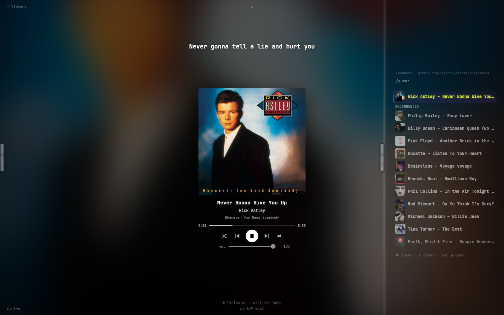
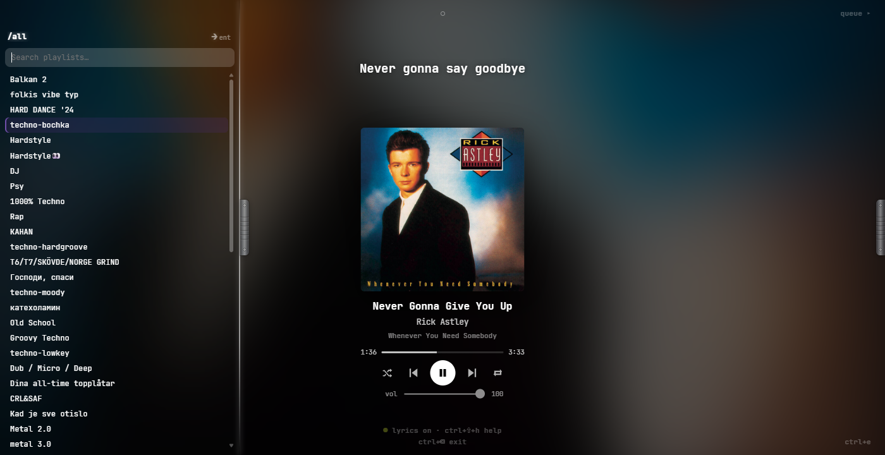
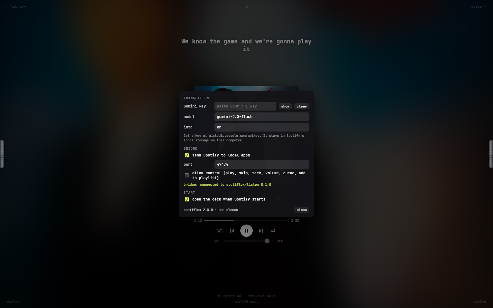

<h1 align="center">spotiflux</h1>

<p align="center"><b>A fullscreen deck for the Spotify desktop app: your library, the player, the queue and the line being sung on one screen, and a local bridge that sends Spotify out to your other apps.</b></p>

<p align="center">
  
</p>

Spotify's desktop app makes you leave what's playing to pick the next playlist, check what's up next or open an album. **spotiflux** turns Spotify's window into a deck you never have to leave. Your library slides in from the left, the queue from the right, and the player stays centred between them, never covered. Above the cover, a slim box shows the lyric line being sung, translated when the song isn't in English. Everything works from the keyboard, and nothing you browse interrupts the song that's playing.

spotiflux also sends Spotify out of its window. Any program on your computer can run a small local server, and spotiflux will tell it what's playing, the lyrics with their timing and translations, and the current line. That's how a native app such as a visualiser, a lyrics overlay or a desktop widget can follow Spotify. If you allow it, such an app can also control playback.

- **The deck.** A dark, blurred copy of the cover fills the window. In the middle are the cover, title, artist, album, a progress bar, the playback buttons and a volume slider.
- **Your whole library, one key away (Ctrl+A).** Folders and playlists open in place, newest tracks first. A click only selects, so browsing never stops the music; Enter plays. Press **Q** to play a track next.
- **Up next, at a glance (Ctrl+E).** The current song, what you queued, the rest of the playlist and Spotify's autoplay picks. Press **C** to clear what you queued.
- **Albums and artists without leaving.** Click the title, album or artist under the cover, or right-click the cover, and they open in the queue pane.
- **Search that widens when you ask.** It starts in the playlist you're looking at, then one key widens it to all your playlists, and one more to all of Spotify.
- **Just the line being sung.** Lyrics come from Spotify itself, or from the free LRCLIB lyrics database when Spotify has none. For songs in other languages, a tiny original sits over the translation, made with your own Gemini key. Ctrl+Shift+L, T and P switch the box, the translation and the pronunciation on and off.
- **Save the song you're hearing in one key.** Ctrl+Shift+S adds it to a playlist you pinned once per session, after a one-key confirm. Ctrl+Shift+A picks or changes that playlist.
- **Out-of-sync lyrics fixed in two clicks.** A faint gear by the lyric box moves this song's lyrics earlier or later.
- **Built for the keyboard.** The arrow keys move between library, player and queue. Space plays and pauses, comma and period jump 10 seconds back and forward, Shift with comma or period changes the volume, Esc clears the screen down to the player, and Ctrl+Backspace leaves the deck.
- **Every key in one searchable place.** Ctrl+Shift+H opens a help screen: type what you want to do, and the keys for it light up on a drawn keyboard.
- **Straight in.** Spotify opens directly in the deck with your library, and a deck icon in the top bar brings you back from any page.
- **Send Spotify to other apps.** A local, read-only bridge by default, for apps on your own computer only.

| Library pane | Settings |
|---|---|
|  |  |

## Install in one line

Open **PowerShell as your normal user (not "Run as administrator")** and paste:

```powershell
irm https://raw.githubusercontent.com/gigacook/spotiflux/main/install.ps1 | iex
```

Spotify restarts and opens straight into the deck. Press **←** or **→** to slide in the library or the queue.

---

## Manual

- [Key terms](#key-terms)
- [Requirements](#requirements)
- [Installing](#installing)
- [Everyday use](#everyday-use)
- [Lyrics, translation and pronunciation](#lyrics-translation-and-pronunciation)
- [Keys](#keys)
- [How it decides things](#how-it-decides-things)
- [Settings](#settings)
- [Send Spotify to other apps](#send-spotify-to-other-apps)
- [Updating and removing](#updating-and-removing)
- [Troubleshooting](#troubleshooting)
- [Reference](#reference)

### Key terms

- **Spicetify** is a tool that modifies the Spotify desktop app so it can load extra code. Everything here runs through it: without it nothing can draw inside Spotify's window or read your library.
- **Extension** means a script Spicetify loads into every Spotify page. `spotiflux.js` is one.
- **Custom app** means a page Spicetify adds to Spotify with its own icon in the top bar. `playlist-home` is one.
- **`spicetify apply`** writes your extensions and apps into Spotify and restarts it. Any change needs it.
- **The deck** is spotiflux's fullscreen: it covers Spotify's own window until you leave it.
- **Library pane** is the panel on the left (Ctrl+A). **Queue pane** is the panel on the right (Ctrl+E).
- **Middle** is the player between them: cover, title, controls, and the lyric box above them.
- **Focus** is the part of the screen your arrow keys, Enter and Backspace act on: the library pane, the middle, or the queue pane.
- **LRCLIB** ([lrclib.net](https://lrclib.net)) is a free, community-run database of song lyrics with timing.
- **Gemini** is Google's AI service. spotiflux uses it, with an API key you create yourself, to translate lyrics.
- **API key** is a long secret string that lets a program use a service on your account. Treat it like a password.
- **Bridge** is spotiflux's connection to other programs on your computer (see [Send Spotify to other apps](#send-spotify-to-other-apps)).
- **Port** is a number that tells programs on the same computer which connection is theirs. The bridge uses 47474 unless you change it.

Everything spotiflux draws uses the JetBrains Mono font if it's installed, and Consolas otherwise.

### Requirements

| You need | How to check |
|---|---|
| Spotify desktop app for Windows | It's installed and you can log in. |
| Spicetify | `spicetify -v` in PowerShell prints a version number. If it doesn't, install it from [spicetify.app](https://spicetify.app). |

That's all. Translation additionally needs a Gemini API key (see [Lyrics, translation and pronunciation](#lyrics-translation-and-pronunciation)), and the bridge needs a program that listens for it.

Built and used with Spotify 1.3.4 and Spicetify 2.45. Other versions will probably work, but internal Spotify queries can change between releases (see [Troubleshooting](#troubleshooting)).

### Installing

The one-line installer above does the following. To do it by hand from a downloaded copy of this repository, run `.\install.ps1` from the repository folder, or follow these steps:

1. Copy `extension\spotiflux.js` into `%APPDATA%\spicetify\Extensions\`.
2. Copy the `apps\playlist-home` folder into `%APPDATA%\spicetify\CustomApps\`.
3. Register both with Spicetify:
   ```powershell
   spicetify config extensions spotiflux.js
   spicetify config custom_apps playlist-home
   ```
4. Run `spicetify apply` from a normal PowerShell window. Spotify closes and opens again.
5. Check it worked: Spotify opens straight into the deck, with steel grips in the middle of the left and right edges and `● lyrics on · ctrl+⇧+h help` at the bottom middle.

The installer refuses to run from an administrator window, because Spicetify files written by an administrator can leave Spotify showing a black window.

If you used this project under its earlier name, ivlyrics-sidecar, the installer unregisters and deletes the old `ivlyrics-sidecar.js` so only one copy runs. Your settings, switches and pinned choices stay, because they live in Spotify's own storage, not in that file. Two things don't carry over: sync offsets made under the old name, and anything ivLyrics did. spotiflux no longer needs ivLyrics; if you don't use it for anything else, you can remove it with `spicetify config custom_apps ivLyrics-` and `spicetify apply`.

### Everyday use

**Start in the deck.** When Spotify starts, spotiflux opens the deck by itself, with the library pane open the first time. To switch this off, open your profile menu (your name or picture at the top right) and untick **Open the spotiflux deck at start**, or untick **open the deck when Spotify starts** in the settings. Tick either one to switch it back on; they're the same switch.

**The Playlists page.** Leaving the deck lands on the Playlists page, which is also where Spotify starts when the automatic deck is off: your playlists and Liked Songs, grouped by folder, with a filter box at the top. Click one: it starts playing, the deck opens and the library pane is already open. When you leave the deck, you're back on the Playlists page. In windows 720 pixels tall or less, the page shows names only.

**Get in and out.** Click the deck icon in Spotify's top bar (three bars, the middle one taller) to open the deck from any page. To leave, press **Ctrl+Backspace**, or click the faint `ctrl+⌫ exit` label at the bottom middle of the screen, between the `ctrl+a` and `ctrl+e` labels. While the library's search box has text in it, Ctrl+Backspace deletes the last word instead, as it does in any text box; clear the box first, or press Esc. Esc and F12 never leave the deck, so a stray key press can't throw you out.

**The player.** The cover sits in the middle with the song's title, artist and album under it, then the progress bar with the elapsed and total time, then five buttons: shuffle, previous, play or pause, next and repeat. Shuffle and repeat light up yellow when they're on, and repeat shows a small `1` when it repeats one song. Click anywhere on the progress bar to jump there. The slider under the buttons sets the volume, with the level next to it. Behind everything, the cover is blown up, blurred and darkened to fill the window.

**The layout.** The player always sits in the middle of the window. The library pane and the queue pane are the same width (27.5% of the window, between 200 and 380 pixels) and share the same see-through dark background, so the player is never covered, even with both open. A slim box between the arrow guide at the top and the cover shows only the lyric line being sung:
- For English songs, it shows just that line, at 19 pixels.
- For songs in other languages, it shows the original line small (10.5 pixels) with the translation right under it (14 pixels), packed tight with no gap.
- With pronunciation switched on, the pronunciation sits between the two in small italics.

**Lyrics, translation and pronunciation on or off.** Three switches decide what the lyric box shows. Each is remembered across Spotify restarts. They only change what's shown: translations are still fetched in the background, so switching back on shows them at once.
- **Ctrl+Shift+L** hides or shows the whole lyric box (and its sync gear). It starts on.
- **Ctrl+Shift+T** hides or shows the translation line. It starts on. With it off, songs in other languages show only the original line, at full size.
- **Ctrl+Shift+P** shows or hides the pronunciation line. It starts off.

Each press shows the new state at the bottom of the screen for a moment, for example `translation off`. The lyric box switch also has a permanent label at the bottom middle, just above `ctrl+⌫ exit`: `● lyrics on` with a yellow dot, or `○ lyrics off` with a hollow one. Click it to switch. Next to it, `ctrl+⇧+h help` opens the help screen.

**Moving around.** One part of the screen has the focus at a time: the library, the middle, or the queue.
- **Arrow keys:** from the middle, ← opens and focuses the library, → opens and focuses the queue. Going back to the middle (→ from the library, ← from the queue) closes that pane again.
- **Snap keys:** Ctrl+A opens the library and closes the queue; Ctrl+E opens the queue and closes the library. The panes jump into place almost instantly, without the usual slide. If nothing in that list is selected yet (and, in the library, no search is running), the cursor goes on the top row. If you're already in that pane, nothing moves, so your place in the list is kept.
- **The arrow guide** sits in yellow at the top middle of the screen, between the `◂ library` and `queue ▸` labels: `lib ◀ ● ▶ que`. Click the dot in the middle to hide the arrows (the dot turns hollow and dimmer) or show them again; your choice is remembered. While the middle has the focus, the dot blinks between white and violet.
- **The focused pane** shows a soft glowing line along its inner edge.
- **Steel grips** on the left and right edges show that the panes slide out; click one to open or close its pane. Faint labels in the corners name the sides (`◂ library`, `queue ▸` at the top) and their snap keys (`ctrl+a`, `ctrl+e` at the bottom) while the pane is closed. Between the two bottom labels, `ctrl+⌫ exit` stays visible all the time; click it to leave the deck. While the `vol` readout is showing, it takes that spot.
- **Clicks** move the focus to where you click. Clicking empty space in the deck closes the queue. Buttons, the progress bar, the slider, the cover and the title, artist and album work as usual.

**Volume.** Scroll the mouse wheel anywhere over the deck (not over a pane, where it scrolls the list) to change the volume. One notch of a normal mouse wheel moves it by 10, in steps of 2; a trackpad moves it smoothly, 2 at a time. A small `vol 64` readout appears at the bottom while you scroll. Every Spotify start begins at full volume (100); after that, the volume you set stays for the session.

From the keyboard, hold Shift and press comma to turn the volume up, or Shift and period to turn it down. This works anywhere in Spotify, on any keyboard layout, because it goes by the key's position rather than the character it types. A single press moves the volume by 6, for a quick, clear change. Keep the keys held to keep going: it continues in fine steps of 2, then speeds up to 4 and 6 within about half a second, so you can creep or sweep with the same keys. The same `vol` readout shows the level.

**Add the playing song to a playlist (Ctrl+Shift+S).** Saving songs you like while you listen takes one key once you've chosen where they go:
1. The first time in a Spotify session, press **Ctrl+Shift+S** (or **Ctrl+Shift+A**). A small picker opens at the top of the screen with a filter box and the playlists you can edit.
2. Move through the list with **↑** and **↓**, or type part of a name to filter it. Press **Enter** to add the song to the chosen playlist and pin that playlist. Press **Tab** instead to only pin it, without adding anything; the bottom of the screen shows `pinned <playlist>`. With nothing chosen, Enter and Tab use the first playlist in the list. The pinned playlist shows `pinned` at the right of its row.
3. From now on, **Ctrl+Shift+S** opens a one-line box at the top: the song's name, then `add to <playlist>?` with a blinking block cursor, like a terminal prompt. Press **Enter** (or Ctrl+Shift+S a second time) to add it, or **Esc** or **Backspace** to cancel. Spotify then shows `Added to <playlist>`.
4. To send songs somewhere else, press **Ctrl+Shift+A** at any time and pick another playlist. That one stays pinned until you change it again.

The pin lasts until Spotify closes, so every new session starts with the picker. If the pinned playlist is deleted or you stop following it, the next Ctrl+Shift+S opens the picker again instead of failing.

**Help (Ctrl+Shift+H).** A dark overlay with a search box, a drawn keyboard and every key spotiflux understands, with where it works. Type what you want to do, for example `add to playlist` or `louder`: the list keeps only the matching commands (every word you type must appear somewhere in the row; with none left it says `No command matches.`), the keys of all matches glow violet on the keyboard, and the chosen row's keys light up in yellow. **↑** and **↓** choose a row. Rows marked `↵ run` are actions: press **Enter** or double-click to close the help and do it, for example switch the translation off or open the settings. **Esc**, Ctrl+Shift+H again or a click outside the box closes it. Clicking `ctrl+⇧+h help` at the bottom middle of the screen opens it too.

Inside either pane, the same keys always do the same thing:
- **A click, or ↑ and ↓,** only selects. Nothing plays or opens.
- **Enter, or a double-click,** goes one level in (a folder, playlist, album or release) or plays the selected track.
- **Backspace** goes one level back. At the top level of a pane, it closes that pane.
- **Esc**, anywhere, closes both panes, any dialog or menu, and the search, leaving just the player. It never leaves the deck.

**Browse your library (Ctrl+A).** The first time you open the library, and whenever you open it after more than a minute away, it starts in the playlist that's playing, with the current track highlighted. Within a minute, it reopens exactly where you left it. While the library has the focus, the typing cursor stays in its search box, so you can type or use the arrow keys without clicking first. The top row shows where you are as a path, for example `/all/techno/dj`. Names too long for the pane are shortened in the middle, so both ends stay readable: `techno-hardgroove` can become `tech…oove`, and parent folders lose their vowels (`techno` becomes `tchn`) or fold into `…` before the current name is cut. Hover the path to see it in full.
- A playlist or Liked Songs opens with each track on one line, "Artist – Song", and the date it was added, newest first. While a list loads it says `Loading…`; an empty folder or playlist says `Nothing here.`
- To hear a track next without leaving your current playlist, hover it and click the yellow **q**, or select it and press Q while the search box is empty. The current song keeps playing; the track goes to the front of Spotify's queue, so it plays right after. In the library its **q** stays lit, and the queue pane shows it with a yellow **u** in front. If Spotify refuses, a notice says `Couldn't queue <name>`.
- Inside a playlist that isn't the one playing, a **back..** button sits at the top right. It opens the playing playlist and highlights the current track.
- The top row also shows the keys as small glowing hints, which you can click too: `← ⌫` left of the path goes up one level, and `→ ent` on the right goes into the selected folder or playlist. At the top level the row shows just `/all`.
- The selection is highlighted in a dark, see-through violet; whatever is playing (playlist or track) is shown in neon yellow, here and in the queue pane.
- Albums and artists saved in your library play when you press Enter on them.

**Search.** Type in the box at the top of the library pane. Search starts in what you're looking at and only widens when you ask:
1. Inside a playlist, it searches that playlist. Inside a folder, it searches that folder.
2. With no matches, the list says `No matches in <name>. Search all playlists? Y ↵`. Press Y or Enter, or click it, to search every playlist name and every song in every playlist. Each song shows which playlist it's in. The first time, this loads all your playlists and shows `Searching all playlists 12/140…` while it works.
3. If that finds nothing either, the same prompt offers to search all of Spotify. If Spotify has nothing either, the list says `No matches anywhere.`

Tab widens the search at any time, even when there are matches.

**See what's up next (Ctrl+E).** The queue pane slides in from the right. It starts with the current song, highlighted, then lists what's next: your manually queued songs (under "Queue", each marked with a yellow `u`), the rest of the playlist, and Spotify's autoplay picks (under "Recommended", only if autoplay is on). With nothing at all coming up, it says `Nothing queued.` A faint path above the list shows where you are, for example `/queue/faceless/engage war`. A hint below the list reminds you of the keys: `⌫ close · c clear · esc player` at the top level, `⌫ back · esc player` inside an album or artist. Above the list, a small `feedback · github.com/gigacook/spotiflux/issues` line can be selected and copied: that's where to report bugs and ideas.

**Clear the queue (C).** With the queue pane focused, press C. Every song you queued yourself (the "Queue" section, marked `u`) is removed, and Spotify shows `Queue cleared`. The rest of the playlist and the autoplay picks stay, as with Spotify's own "Clear queue". If you haven't queued anything, it shows `Nothing queued`.

**Albums and artists, without leaving the deck.**
- Clicking the **song title** or the **album name** under the cover opens the album in the queue pane: cover, title, artist and year, then numbered tracks with their lengths.
- Clicking the **artist name** opens the artist's releases, newest first, with year and type. Enter on one opens its tracks.
- **Right-clicking the cover** opens a small menu: Show album, Show artist, and Add to playlist. Add to playlist shows a filter box and the playlists you can edit (`Loading playlists…` the first time, `No playlists match.` when the filter matches none). Click one, or choose with ↑ and ↓ and press Enter (Enter alone takes the first match), and the song is added to the end of it. This adds once and doesn't pin anything.

**Fix lyrics timing.** Move the mouse near the lyric box and a faint gear appears to its right. Click it to open the sync dialog:
- **◀ + earlier** shows the lyrics sooner; **− ▶ later** shows them later. The number turns blue for earlier and amber for later, the bar grows from the centre in that direction, and the number kicks left or right with each press.
- The step buttons set how far each press moves: 10, 50, 100, 250, 500 or 1000 milliseconds. Your choice is remembered.
- **reset** puts the song back to 0. The offset is saved for this song only and is limited to 10 seconds either way. Apps on the bridge get the corrected timing too.

### Lyrics, translation and pronunciation

**Where lyrics come from.** When a song starts, spotiflux asks Spotify for its own lyrics, the same ones Spotify's lyrics view shows. If Spotify has none, it asks LRCLIB. While it asks, the lyric box shows a quiet `loading spotify…` or `loading lrclib…`. Lyrics found once are kept for the last 40 songs, so replaying a song shows them at once.

**When there are no lyrics.** If neither source has lyrics with timing, the lyric box stays empty and the sync gear is hidden. Lyrics without timing (some songs only have the plain text) are not shown in the box, because there's no way to know which line is being sung, but apps on the bridge still receive the text.

**Translation.** For songs that aren't in English, spotiflux sends all the lyric lines to Gemini once per song and shows the translation under each line. Translations are kept for the last 40 songs and languages, so a song is only translated once. Nothing is sent to Gemini for English songs, and nothing at all without a key.

To set it up:
1. Open [aistudio.google.com/apikey](https://aistudio.google.com/apikey), sign in with a Google account and create an API key.
2. In Spotify, open your profile menu and click **spotiflux settings…**.
3. Paste the key into **Gemini key**. It's saved as soon as you click elsewhere or press Enter, and the song that's playing is translated straight away.

Google offers a free tier for Gemini that covers this kind of personal use (not verified for every account and region; check the limits on your Google AI Studio page). The key is stored in Spotify's own storage on this computer. spotiflux sends it only to Google's API, in a request header, never in a web address. It's never written to the console, never shown unless you click **show**, and never sent over the bridge.

**Pronunciation.** The same Gemini call also returns a pronunciation in Latin letters for lines that aren't written in Latin script, for example romaji for Japanese. Press Ctrl+Shift+P to show it. Songs in languages written with Latin letters have no pronunciation line.

### Keys

All of these work in the deck only, except Space, comma and period (with or without Shift), which work everywhere in Spotify. Q queues the selected track whenever the search box is empty, so while a track is selected, a search can't start with Q: start with another part of the name instead (`ueen` finds Queen). Ctrl+Shift+H shows this table inside Spotify, searchable.

The Ctrl+Shift keys were chosen so that no existing key changes, neither spotiflux's nor Spotify's: Spotify already uses Ctrl+S for shuffle, and Ctrl+A stays the library key.

| Press | Where it works | What happens |
|---|---|---|
| Space | Anywhere in Spotify | Plays or pauses. The only exception is a text box that already has text in it, where Space types a space so multi-word searches still work. |
| , (comma) | Anywhere in Spotify | Jumps 10 seconds back. A small `◀ 10s` shows at the bottom in the deck. Same text-box exception as Space. |
| . (period) | Anywhere in Spotify | Jumps 10 seconds forward (`10s ▶`). Same text-box exception as Space. |
| Shift+, (comma) | Anywhere in Spotify | Volume up by 6. Held down, it keeps going in steps of 2, speeding up to 4 and then 6. Same text-box exception as Space. |
| Shift+. (period) | Anywhere in Spotify | Volume down, the same way. |
| Ctrl+Shift+S | Deck | Asks `add to <playlist>?` for the playing song; Enter adds it to the pinned playlist. With no playlist pinned yet, opens the playlist picker. Pressed while the question is showing, it answers yes. |
| Ctrl+Shift+A | Deck | Opens the playlist picker to pin a different playlist. |
| Ctrl+Shift+L | Deck | Lyric box on or off. |
| Ctrl+Shift+T | Deck | Translation line in the lyric box on or off. |
| Ctrl+Shift+P | Deck | Pronunciation line in the lyric box on or off. |
| Ctrl+Shift+H | Deck | Opens or closes the help screen. |
| Esc | Deck | Closes both panes, dialogs, menus, the help and the search. Just the player is left. While the help is open, Esc closes only the help. In the settings dialog (anywhere in Spotify), Esc closes the settings. |
| Ctrl+Backspace | Deck, except a text box with text in it | Leaves the deck. Same as clicking `ctrl+⌫ exit` at the bottom middle. In a text box with text, it deletes the last word. |
| Ctrl+A | Deck | Library pane open and focused, queue closed, cursor on the top row if nothing was selected. Does nothing if you're already there. |
| Ctrl+E | Deck | Queue pane open and focused, library closed, cursor on the top row if nothing was selected. Does nothing if you're already there. |
| F12 | Deck | Nothing, so it can't do anything by accident. |
| Mouse wheel | Over the deck, outside the panes, menus and the sync dialog | Volume up or down by 10 per notch, in steps of 2. |
| ← | Middle | Focuses the library pane, opening it if needed. |
| → | Middle | Focuses the queue pane, opening it if needed. |
| → | Library pane, cursor at the end of the search text | Closes the library and focuses the middle. |
| ← | Queue pane | Closes the queue and focuses the middle. |
| ↑ or ↓ | Library or queue pane | Moves the selection. The first press starts from the playing track. |
| Enter | Library or queue pane | Goes one level in, or plays the selected track. |
| Backspace | Library or queue pane | Goes one level back, or closes the pane at its top level. In the library, it deletes text while the search box has any. |
| C | Queue pane | Clears the songs you queued yourself. The playlist and autoplay picks stay. |
| Q | Library pane, a track selected, search box empty | Puts the selected track first in the queue. With text in the box, Q just types. |
| Y, Enter or Tab | Library search with no matches | Widens the search: this view, then all playlists, then Spotify. Tab works even with matches. |
| + (or =) or ← | Sync dialog | Moves the lyrics earlier by one step. |
| − (or _) or → | Sync dialog | Moves the lyrics later by one step. |
| 1 to 6 | Sync dialog | Picks the step size: 10, 50, 100, 250, 500 or 1000 ms. |
| 0 | Sync dialog | Resets the offset to 0. |
| Backspace | Sync dialog or right-click menu | Closes it, or in the right-click menu's playlist list, goes back to the menu. |
| ↑ or ↓ | Playlist picker, right-click playlist list, help | Moves the choice. |
| Enter | Playlist picker | Adds the song to the chosen playlist (the first one if none is chosen) and pins it. |
| Tab | Playlist picker | Pins the chosen playlist without adding the song. |
| Enter | Add-to-playlist question | Adds the song to the pinned playlist. |
| Esc or Backspace | Playlist picker or add-to-playlist question | Closes it without adding. In the picker, Backspace deletes filter text first. |
| Enter | Help, on a row marked `↵ run` | Closes the help and does what the row says. |

### How it decides things

**Where the player sits.** Worked out when the deck opens, when the window changes size, and when the player's height changes (a long title wrapping onto a second line):
1. The cover's size is 36% of the window height, but never wider than 85% of the space between the panes, and between 140 and 340 pixels.
2. Horizontally, the player block (cover down to the volume slider) is centred in the window.
3. Vertically, its top sits at 28% of the window height, leaving room for the lyric box above it. If that would push the volume slider off the bottom, it moves up just enough to fit.
4. The lyric box fills the space between the panes (at most 440 pixels wide), from just under the arrow guide at the top down to just above the cover. The line is centred in that space.
5. The queue list fills the band from 33% to 66% of the window height, or the player's full height if that's taller, so the list lines up with the player.

**Which lyrics it shows.** In this order, stopping at the first that has lyrics:
1. Lyrics already found for this song in the last 40 songs.
2. Spotify's own lyrics (only for Spotify tracks, not local files).
3. LRCLIB, looked up by title, first artist, album and length. If that exact match fails, LRCLIB's search by title and artist, preferring a result whose length is within 3 seconds of the song's.

The current line is the last line whose start time has passed, checked four times a second, with this song's sync offset added.

**Whether a song counts as English.** Spotify tells spotiflux the language of its lyrics, and that decides. For LRCLIB lyrics, which carry no language, spotiflux counts them as English when nearly all letters are plain A to Z and common English words make up more than 12% of the words. English songs show only the original line and are never sent to Gemini.

**Which playlists "Add to playlist" offers.** Playlists you own, collaborative ones, and ones Spotify says you can add to. If it can't tell, it lists all playlists; adding to one you can't edit then fails with `Couldn't add to <name>`.

**Window buttons.** Minimise, maximise and close stay hidden. Rest the mouse in the top-right corner (the last 150 by 56 pixels) for half a second and they appear; move away and they hide.

### Settings

Open your profile menu (your name or picture at the top right of Spotify) and click **spotiflux settings…**. The dialog opens over whatever page you're on. Every change is saved as soon as you leave the field or tick the box; there's no save button. **close**, Esc or a click outside the box closes it. All settings live in Spotify's own storage on this computer (see [Reference](#reference)); a missing value uses its default.

**Translation**

| Setting | Default | Meaning |
|---|---|---|
| Gemini key | empty | Your Gemini API key. Empty means no translation and no pronunciation. **show** reveals it, **clear** removes it. |
| model | `gemini-2.5-flash` | Which Gemini model translates. Any model name from Google AI Studio that can answer text works. |
| into | `en` | The language to translate into, as a short language code: `en` English, `de` German, `sv` Swedish, `es` Spanish, `ja` Japanese, and so on. |

Changing any of these translates the playing song again with the new setting.

**Bridge**

| Setting | Default | Meaning |
|---|---|---|
| send Spotify to local apps | on | Whether spotiflux looks for an app to talk to. Off means no connection attempts at all. |
| port | 47474 | Which port to connect to on this computer. Any number from 1024 to 65535; anything else falls back to 47474. Must match the app's port. |
| allow control | off | Whether a connected app may play, pause, skip, seek, change the volume, queue a track or add the song to a playlist. Off means apps can only read. |

Under these, a status line says what the bridge is doing (see [Send Spotify to other apps](#send-spotify-to-other-apps)).

**Start**

| Setting | Default | Meaning |
|---|---|---|
| open the deck when Spotify starts | on | The same switch as **Open the spotiflux deck at start** in the profile menu. |

### Send Spotify to other apps

**What it shares.** While the bridge is on and an app is listening, spotiflux sends that app:
- what's playing: title, artists, album, cover picture address, length, position, whether it's playing, volume, shuffle, repeat, and the playlist or album it plays from;
- the lyrics of the song with their timing, where they came from, and the translation and pronunciation of each line once Gemini made them;
- the number of the line being sung, every time it changes.

It never sends your settings, your Gemini key, your library or your listening history.

**How to turn it on.** It's on by default. spotiflux looks for an app on port 47474 of your own computer: right after Spotify starts, then after 2, 5 and 15 seconds, then once a minute. Nothing happens until an app is there. The settings show:

```
bridge: waiting for an app on 127.0.0.1:47474
```

When an app connects and introduces itself, the line changes to, for example:

```
bridge: connected to GIGAPLAY 0.1.0
```

`bridge: connected to an app` means a program connected but hasn't said its name yet. `bridge: off` means you switched the bridge off.

**Allow control.** Off by default. With it off, apps can read everything above but every command they send is answered with `control off` and nothing happens. Switch it on in the settings only while you use an app you trust to control playback.

**How safe it is.**
- The bridge only ever connects to your own computer (127.0.0.1). Nothing goes over your network or the internet.
- Apps can only read unless you allow control.
- Your Gemini key and other settings are never sent.
- Any program running on your computer could listen on the port and read what you're playing. That's the reason control stays off until you allow it. If you don't use any app with spotiflux, untick **send Spotify to local apps**.

**Try it.** This repository includes a small listener that prints everything spotiflux sends. It needs Rust (`cargo --version` prints a version; install it from [rustup.rs](https://rustup.rs) otherwise). In PowerShell, from the repository folder:

```powershell
cd bridge
cargo run --example listen
```

Within a minute (or at once, if Spotify starts after it) you'll see lines like:

```
listening on ws://127.0.0.1:47474  (type a command, or quit)
connected
hello  spotiflux 2.0.0 on Spotify 1.3.4.258  control off
state  ▶ Coldax, Disaster - Nitro  0:42/2:46  vol 100%
lyrics Spotify synced=true lang=en 38 lines, 0 translated
line     4 [0:41] ...
```

Type a command and press Enter: `toggle`, `play`, `pause`, `next`, `prev`, `seek 60000` (milliseconds), `volume 0.5` (0 to 1), `queue spotify:track:…`, `add` (to the pinned playlist) or `add spotify:playlist:…`, and `get state`, `get lyrics` or `get queue`. With control off, commands answer `ack    ok=false error=control off`. `quit` stops it. To use another port, give it as a number: `cargo run --example listen 47475`.

**For developers.** The protocol is described for any programming language in [docs/bridge.md](docs/bridge.md), including how to use it from GIGAPLAY and from C#. Rust apps can use the `bridge` folder as a library.

### Updating and removing

- **Update:** run the install line again. It overwrites both files and runs `spicetify apply`.
- **After a Spotify update:** Spotify updates wipe Spicetify changes, and Spotify looks plain again. Run `spicetify backup apply` (Spicetify's own fix), then the install line again if the deck doesn't come back.
- **Remove:** run `.\uninstall.ps1` from the repository, or by hand: `spicetify config extensions spotiflux.js-` and `spicetify config custom_apps playlist-home-` (the trailing `-` removes the entry), then `spicetify apply`. Your settings stay in Spotify's storage, unused, until Spotify's cache is cleared.

### Troubleshooting

**`Run this from a normal (non-administrator) PowerShell window.`**
The installer was started from an administrator window. Open PowerShell from the Start menu without "Run as administrator" and run it again.

**`Spicetify not found. Install it first: https://spicetify.app`**
`spicetify` isn't on your PATH. Install Spicetify, close and reopen PowerShell, and check that `spicetify -v` works.

**`spicetify apply failed. Run 'spicetify backup apply', then run this installer again.`**
Spicetify couldn't write its changes into Spotify, usually because Spotify updated itself or Spicetify was never applied on this computer. Run `spicetify backup apply` from a normal PowerShell window, then the install line again. The uninstaller shows the same message for the same reason.

**Spotify shows a black or blank window after installing.**
`spicetify apply` ran as administrator at some point. Run `spicetify restore`, then `spicetify backup apply` from a normal window, then the installer again.

**Spotify looks plain, without the deck or the deck icon.**
Spotify updated itself and removed Spicetify's changes. Run `spicetify backup apply` from a normal PowerShell window. If the deck is still missing, run the install line again.

**The arrow keys, Ctrl+A or Ctrl+E do nothing.**
They only work in the deck. If they still do nothing there, the extension isn't loaded: check that `spicetify config extensions` lists `spotiflux.js`, and run `spicetify apply`.

**`Couldn't load this album.` or `Couldn't load this artist.`**
These use internal Spotify queries that can change with Spotify updates. Open Spotify's own album or artist page once and try again. If it keeps failing, open an issue with your Spotify version.

**Spotify-wide search shows `No matches anywhere.` for something that exists.**
The search query definition loads with Spotify's Search page. Open the Search page once, then try again.

**`Couldn't add to <playlist>`**
You can't edit that playlist (it belongs to someone else and isn't collaborative). Pick one of your own.

**`Can't play <name>`**
Spotify refused to play that item, usually because it's unavailable in your country or was removed. Try another one.

**The deck icon is missing from Spotify's top bar.**
On Spotify 1.3.4, Spicetify's own top-bar buttons don't appear, so spotiflux puts its icon in the row of custom-app icons (the Playlists page and Marketplace icons, for example), a few seconds after Spotify starts. If you have no custom apps installed, that row doesn't exist and the icon can't be placed. The deck still opens by itself at start; to get the icon, install the Playlists page with the installer.

**The window buttons are always visible.**
Your Spotify version doesn't expose the function that hides them. Everything else still works.

**Ctrl+Backspace doesn't leave the deck.**
The library's search box has text in it, so the key deletes a word there instead. Press Esc to clear the search, then Ctrl+Backspace again, or click `ctrl+⌫ exit` at the bottom middle.

**`Couldn't queue <name>`**
Spotify refused to add the track to the queue. Try again. If it keeps failing, restart Spotify, and if that doesn't help, open an issue with your Spotify version.

**`Couldn't clear the queue`**
Spotify refused the request. Try again. If it keeps failing, restart Spotify, and if that doesn't help, open an issue with your Spotify version.

**`Nothing queued`**
You pressed C, but you haven't queued any songs yourself. The rest of the playlist isn't touched by C.

**The gear never appears.**
It only shows while the mouse is near the lyric box, and it's hidden on songs without timed lyrics and while the lyric box is switched off.

**The lyric box is gone.**
It's switched off: the label at the bottom middle reads `○ lyrics off`. Click it or press Ctrl+Shift+L.

**The lyric box stays empty for a song.**
Neither Spotify nor LRCLIB has lyrics with timing for it, or the song is instrumental or a podcast. Nothing can be shown; the sync gear is hidden too. LRCLIB grows every day, so a song can get lyrics later: they're looked up again after Spotify restarts.

**The lyric box keeps saying `loading lrclib…`.**
LRCLIB is slow or unreachable. spotiflux waits for its answer and asks one question at a time, as LRCLIB requests. Check your internet connection; the next song tries again.

**`translation needs a Gemini key (settings)`**
You pressed Ctrl+Shift+T without a Gemini key (it says so on the first press after each Spotify start). Translations only exist with a key: set one up as described in [Lyrics, translation and pronunciation](#lyrics-translation-and-pronunciation).

**`translation failed: Gemini 400`, `Gemini 403` or another number**
Google refused the request. 400 or 403 usually mean the key is wrong, was deleted, or isn't allowed to use the Gemini API: create a new key and paste it into the settings. 404 means the model name in the settings doesn't exist: put back `gemini-2.5-flash`. 429 means the free quota is used up for now: wait, or check the limits in Google AI Studio. The message shows once per song.

**`translation failed: Gemini reply unreadable`**
Gemini answered, but not with the list of lines spotiflux asked for. This happens now and then; the next song tries again. If it happens for every song, try another model in the settings.

**`translation failed: Failed to fetch`**
spotiflux couldn't reach Google at all. Check your internet connection.

**The lyric box shows a translation on an English song, or none on another language.**
For LRCLIB lyrics the language is guessed by counting common English words, so very short or mixed-language lyrics can fool it. Spotify's own lyrics carry their language and aren't guessed. A song in another language only gets a translation once a Gemini key is set.

**Pronunciation is on, but no pronunciation line shows.**
The song is written in Latin letters, so there's nothing to romanise, or no Gemini key is set.

**`Nothing is playing`**
Ctrl+Shift+S or the picker was used with no song loaded. Start a song, then try again.

**Ctrl+Shift+A opens the library instead of the playlist picker.**
Spotify treats Ctrl+A as "select all" before the page sees it, and spotiflux tells the two apart by whether Shift is held at that moment. Press Shift first and keep it down while you press Ctrl and A. If it still happens, use Ctrl+Shift+S, which opens the picker whenever nothing is pinned, or the `ctrl+⇧+a` row in the help (Ctrl+Shift+H).

**Ctrl+Shift+S asks for a playlist again.**
Either Spotify was restarted (the pin lasts one session) or the pinned playlist can no longer be edited. Pick one, and it stays pinned for the rest of the session.

**Spotify doesn't open the deck by itself.**
The automatic deck only opens when Spotify starts on its home page, and it can be switched off in the profile menu (**Open the spotiflux deck at start**) or the settings. Check that it's ticked, or click the deck icon in the top bar.

**`bridge: waiting for an app on 127.0.0.1:47474` never changes.**
No program is listening on that port. Start the app you want to connect (or `cargo run --example listen`), and check that its port matches the one in the settings. spotiflux checks once a minute after the first few tries; switching the bridge off and on in the settings makes it try at once.

**`bridge: can't open a connection (…)`**
Spotify refused to open the connection at all, which shouldn't happen on a normal install. Check that the port in the settings is a number between 1024 and 65535, then switch the bridge off and on.

**Spotify's developer console shows `WebSocket connection to 'ws://127.0.0.1:47474/' failed`.**
That's Spotify reporting each try while no app is listening. It's harmless. Untick **send Spotify to local apps** if you don't use the bridge.

**An app's commands answer `control off`.**
Allow control is off in the settings. Tick **allow control** if you want that app to control playback.

**An app's commands answer `bad uri`, `bad playlist_uri`, `bad position_ms`, `bad value`, `unknown cmd` or `unknown what`.**
The app sent a command spotiflux doesn't accept. This is a problem in that app; [docs/bridge.md](docs/bridge.md) lists what each command needs.

**An app's add-to-playlist command answers `no pinned playlist` or `not an editable playlist`.**
Without a playlist address, the command adds to the playlist you pinned with Ctrl+Shift+A, and none is pinned in this Spotify session. With an address, that playlist isn't one you can edit. Pin a playlist, or use one of your own.

**An app's commands answer `queue refused` or `add failed`.**
Spotify refused the request, just as with `Couldn't queue` and `Couldn't add to` above.

### Reference

Files and storage on your computer. "Spotify's local storage" is browser-style storage inside Spotify's own profile folder; it survives restarts and updates, and is cleared only when Spotify's cache is.

| Where | What it's for |
|---|---|
| `%APPDATA%\spicetify\Extensions\spotiflux.js` | The extension. |
| `%APPDATA%\spicetify\CustomApps\playlist-home\` | The Playlists page. |
| Spotify's local storage, key `ivlib:open` | Whether the library pane was open, so it reopens with the deck. |
| Spotify's local storage, key `ivlib:autostart` | `0` when the deck shouldn't open at start. |
| Spotify's local storage, key `ivsync:step` | The last sync step size. |
| Spotify's local storage, key `ivsync:offsets` | The sync offset of each song you adjusted, in milliseconds. |
| Spotify's local storage, key `ivhint:hidden` | Whether you hid the arrow guide with its dot. |
| Spotify's local storage, keys `ivlyr:on`, `ivlyr:tr`, `ivlyr:ph` | The lyric box, translation and pronunciation switches (`1` on, `0` off). |
| Spotify's local storage, keys `spotiflux:gemini-key`, `spotiflux:gemini-model`, `spotiflux:lang` | The translation settings. |
| Spotify's local storage, keys `spotiflux:bridge`, `spotiflux:port`, `spotiflux:control` | The bridge settings. |
| Spotify's local storage, keys `spotiflux:lyrics-cache`, `spotiflux:tr-cache` | Lyrics and translations of the last 40 songs. |

The keys starting with `ivlib`, `ivsync`, `ivhint` and `ivlyr` keep the names from this project's earlier name, so existing users keep their state. The pinned playlist for Ctrl+Shift+S is kept in memory only, never on disk, so it's forgotten when Spotify closes.

Source layout:

| Path | What it does |
|---|---|
| `extension/spotiflux.js` | Everything inside Spotify: the deck (`renderDeck`, `tickDeck`, `layout`), lyric box and its switches, lyrics fetching, line clock and Gemini translation (`loadLyrics`, `lyricClock`, `translate`), both panes, focus and keys (one handler, `onKey`; Ctrl+Shift commands in `CMDS`), search, album and artist views, right-click menu and playlist picker, help (`HELP` holds the key table), sync dialog, settings dialog, the bridge client (`bridgeConnect`, `onBridgeFrame`), window buttons. |
| `apps/playlist-home/` | The Playlists start page. It calls `window.ivlib.launch()` from the extension to play and open the deck. |
| `bridge/` | The receiver side of the bridge as a Rust library (`spotiflux-bridge`): message types, `parse` and `encode`, and a server (`Bridge::listen`) for native apps. `examples/listen.rs` is the listener above; `fixtures/` holds one example of every message, used by the tests in `tests/`. |
| `docs/bridge.md` | The bridge protocol for any language. |
| `install.ps1`, `uninstall.ps1` | Installer and uninstaller for Windows. |
| `docs/shots/` | README screenshots. |

spotiflux is an independent add-on. It isn't affiliated with Spotify, Google or LRCLIB.
