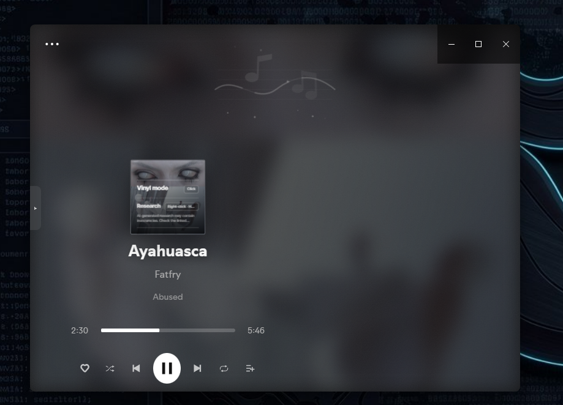

<h1 align="center">ivlyrics-sidecar</h1>

<p align="center"><b>Library, player and queue on one fullscreen. No more bouncing back to Spotify.</b></p>

<p align="center">
  
</p>

ivLyrics has a beautiful fullscreen mode, but you can't do much from it. To pick a playlist, see what's next or look at an album, you have to leave fullscreen and go back to the normal Spotify window. **ivlyrics-sidecar** turns the fullscreen into a three-part deck: your library on the left, the player in the middle, the queue on the right. It also removes the parts that get in the way.

- **Ctrl+A: your library.** Playlists open in place, newest tracks first. Browsing never interrupts the song: a click selects, Enter goes in. Press **q** to play a track next, and **back..** returns to what's playing.
- **Ctrl+E: what's up next.** The current song, your queue and autoplay picks.
- **The player never gets covered.** Both panes stop short of the middle, and the current lyric line sits in a slim box above the player.
- **Keyboard first.** ← opens the library, → the queue, ↑ leaves fullscreen. ↑ and ↓ move the selection, Enter goes one level in, Backspace one level back, Esc brings you back to just the player. Space plays or pauses anywhere.
- **Scroll for volume.** The mouse wheel over the player changes the volume in steps of 2.
- **Albums and artists in place.** Click the album, title or artist, or right-click the cover, and they open in the queue pane instead of throwing you out of fullscreen.
- **Lyrics sync in two clicks.** A faint gear next to the lyric box nudges the lyrics earlier or later for the current song.
- **One click in.** A deck icon in Spotify's top bar opens ivLyrics fullscreen from anywhere, and Spotify opens on your playlists; picking one drops you straight in.

| Library pane |
|---|
|  |

<details><summary>Before: the stock ivLyrics fullscreen</summary>



</details>

## Install in one line

Open **PowerShell as your normal user (not "Run as administrator")** and paste:

```powershell
irm https://raw.githubusercontent.com/gigacook/ivlyrics-sidecar/main/install.ps1 | iex
```

Spotify restarts. Click the deck icon in the top bar (three bars, the middle one taller), then press **←** or **→**.

---

## Manual

- [Key terms](#key-terms)
- [Requirements](#requirements)
- [Installing](#installing)
- [Everyday use](#everyday-use)
- [Keys](#keys)
- [How it decides things](#how-it-decides-things)
- [Recommended ivLyrics settings](#recommended-ivlyrics-settings)
- [Updating and removing](#updating-and-removing)
- [Troubleshooting](#troubleshooting)
- [Reference](#reference)

### Key terms

- **Spicetify** is a tool that modifies the Spotify desktop app so it can load extra code. Everything here runs through it.
- **ivLyrics** is a Spicetify custom app that shows synced lyrics and has its own fullscreen mode. ivlyrics-sidecar only works on top of it.
- **Extension** means a script Spicetify loads into every Spotify page. `ivlyrics-sidecar.js` is one.
- **Custom app** means a page Spicetify adds to Spotify with its own icon in the top bar. `playlist-home` is one.
- **`spicetify apply`** writes your extensions and apps into Spotify and restarts it. Any change needs it.
- **Library pane** is the panel on the left (Ctrl+A). **Queue pane** is the panel on the right (Ctrl+E).
- **Middle** is the player between them: cover, title, controls, and the lyric box above them.
- **Focus** is the part of the screen your arrow keys, Enter and Backspace act on: the library pane, the middle, or the queue pane.

Everything ivlyrics-sidecar draws uses the JetBrains Mono font if it's installed, and Consolas otherwise.

### Requirements

| You need | How to check |
|---|---|
| Spotify desktop app for Windows | It's installed and you can log in. |
| Spicetify | `spicetify -v` in PowerShell prints a version number. If it doesn't, install it from [spicetify.app](https://spicetify.app). |
| ivLyrics, installed through Spicetify | It has an icon in Spotify's top bar, and `spicetify config custom_apps` lists `ivLyrics`. |

Built and used with Spotify 1.3.3, Spicetify 2.45 and ivLyrics 6.6. Other versions will probably work, but internal Spotify queries can change between releases (see [Troubleshooting](#troubleshooting)).

### Installing

The one-line installer above does the following. To do it by hand from a downloaded copy of this repository, run `.\install.ps1` from the repository folder, or follow these steps:

1. Copy `extension\ivlyrics-sidecar.js` into `%APPDATA%\spicetify\Extensions\`.
2. Copy the `apps\playlist-home` folder into `%APPDATA%\spicetify\CustomApps\`.
3. Register both with Spicetify:
   ```powershell
   spicetify config extensions ivlyrics-sidecar.js
   spicetify config custom_apps playlist-home
   ```
4. Run `spicetify apply` from a normal PowerShell window. Spotify closes and opens again.
5. Check it worked: Spotify opens on a grid of your playlists, and in ivLyrics fullscreen a small tab sits in the middle of the left edge.

The installer refuses to run from an administrator window, because Spicetify files written by an administrator can leave Spotify showing a black window. It also stops if ivLyrics isn't installed.

### Everyday use

**Start from your playlists.** Spotify opens on the Playlists page: your playlists and Liked Songs, grouped by folder, with a filter box at the top. Click one: it starts playing, ivLyrics goes fullscreen and the library pane is already open. When you leave fullscreen, you're back on the Playlists page. In windows 720 pixels tall or less, the page shows names only.

**Get in and out.** Click the deck icon in Spotify's top bar (three bars, the middle one taller) to jump straight into ivLyrics fullscreen from any page. Leave with ↑ from the middle. ivLyrics' own fullscreen key (F12 by default) is switched off so it can't throw you out by accident; the ivLyrics menu in the bottom-right corner still has "Exit Fullscreen".

**The layout.** In ivLyrics fullscreen, the player always sits in the middle of the window. The library pane and the queue pane are the same width (27.5% of the window, between 200 and 380 pixels) and share the same see-through dark background, so the player is never covered, even with both open. ivLyrics' own lyrics column is hidden. Instead, a slim box above the player shows only the line being sung:
- For English songs, it shows just that line.
- For songs in other languages, it shows the original line very small (8 pixels) with the translation right under it (10 pixels), packed tight with no gap. The translation comes from ivLyrics, so it only appears if translation is turned on there.

While lyrics are still loading, the lyric box shows a quiet `loading lrclib…` (with the provider's name) instead of ivLyrics' loading badge.

**Moving around.** One part of the screen has the focus at a time: the library, the middle, or the queue.
- **Arrow keys:** from the middle, ← opens and focuses the library, → opens and focuses the queue. Going back to the middle (→ from the library, ← from the queue) closes that pane again.
- **Snap keys:** Ctrl+A opens the library and closes the queue; Ctrl+E opens the queue and closes the library. Either one puts the cursor on the top row of its list. If you're already in that pane, nothing moves, so your place in the list is kept.
- **The arrow guide** between the lyric box and the player shows ← library, ↑ exit and → queue around a small dot. Click the dot to hide the guide (the dot turns hollow and dimmer) or show it again; your choice is remembered. While the middle has the focus, a ring blinks around the dot.
- **The focused pane** shows a soft glowing line along its inner edge.
- **Steel grips** on the left and right edges show that the panes slide out; click one to open or close its pane. Faint labels in the corners name the sides (`◂ library`, `queue ▸` at the top) and their snap keys (`ctrl+a`, `ctrl+e` at the bottom) while the pane is closed.
- **Clicks** move the focus to where you click. Clicking empty space in the middle closes the queue. Clicking buttons, the progress bar, the cover and links works as usual.

**Volume.** Scroll the mouse wheel anywhere over the player (not over a pane, where it scrolls the list) to change the volume in steps of 2. A small `vol 64` readout appears at the bottom while you scroll. Every Spotify start begins at full volume (100); after that, the volume you set stays for the session. ivlyrics-sidecar also switches on ivLyrics' own volume slider in fullscreen.

Inside either pane, the same keys always do the same thing:
- **A click, or ↑ and ↓,** only selects. Nothing plays or opens.
- **Enter, or a double-click,** goes one level in (a folder, playlist, album or release) or plays the selected track.
- **Backspace** goes one level back. At the top level of a pane, it closes that pane.
- **Esc**, anywhere, closes both panes, any dialog or menu, and the search, leaving just the player. Esc never exits fullscreen; ↑ from the middle does.

**Browse your library (Ctrl+A).** The first time you open the library, and whenever you open it after more than a minute away, it starts in the playlist that's playing, with the current track highlighted. Within a minute, it reopens exactly where you left it. While the library has the focus, the typing cursor stays in its search box, so you can type or use the arrow keys without clicking first. The top row shows where you are as a path, for example `/all/techno/dj`. Names too long for the pane are shortened in the middle, so both ends stay readable: `techno-hardgroove` can become `tech…oove`, and parent folders lose their vowels (`techno` becomes `tchn`) or fold into `…` before the current name is cut. Hover the path to see it in full.
- A playlist or Liked Songs opens with each track on one line, "Artist – Song", and the date it was added, newest first.
- To hear a track next without leaving your current playlist, hover it and click the yellow **q**, or select it and press Q while the search box is empty. It goes to the front of Spotify's queue, and the queue pane shows it with a yellow **u** in front.
- While you're looking at a different playlist than the one playing, a **back..** button sits at the top right. It opens the playing playlist and highlights the current track.
- Albums and artists saved in your library play when you press Enter on them.

**Search.** Type in the box at the top of the library pane. Search starts in what you're looking at and only widens when you ask:
1. Inside a playlist, it searches that playlist. Inside a folder, it searches that folder.
2. With no matches, the list says `No matches in <name>. Search all playlists? Y ↵`. Press Y or Enter, or click it, to search every playlist name and every song in every playlist. Each song shows which playlist it's in. The first time, this loads all your playlists and shows `Searching all playlists 12/140…` while it works.
3. If that finds nothing either, the same prompt offers to search all of Spotify.

Tab widens the search at any time, even when there are matches.

**See what's up next (Ctrl+E).** The queue pane slides in from the right. It starts with the current song, highlighted, then lists what's next: your manually queued songs (under "Queue", each marked with a yellow `u`), the rest of the playlist, and Spotify's autoplay picks (under "Recommended", only if autoplay is on). A faint path above the list shows where you are, for example `/queue/faceless/engage war`. A hint below the list reminds you of the keys: `⌫ close · esc player` at the top level, `⌫ back · esc player` inside an album or artist. Above it, a small `feedback · github.com/gigacook/ivlyrics-sidecar/issues` line can be selected and copied.

**Albums and artists, without leaving fullscreen.**
- Clicking the **album name** or the **song title** under the cover opens the album in the queue pane: cover, title, artist and year, then numbered tracks with their lengths.
- Clicking the **artist name** opens the artist's releases, newest first, with year and type. Enter on one opens its tracks.
- **Right-clicking the cover** opens a small menu: Show album, Show artist, and Add to playlist. Add to playlist shows a filter box and the playlists you can edit. Pick one, or type and press Enter for the first match, and the song is added to the end of it.

**Fix lyrics timing.** Move the mouse near the lyric box and a faint gear appears to its right. Click it to open the sync dialog:
- **◀ + earlier** shows the lyrics sooner; **− ▶ later** shows them later. The number turns blue for earlier and amber for later, the bar grows from the centre in that direction, and the number kicks left or right with each press.
- The step buttons set how far each press moves: 10, 50, 100, 250, 500 or 1000 milliseconds. Your choice is remembered.
- **reset** puts the song back to 0. The offset is saved for this song only, using ivLyrics' own per-song offset, and ivLyrics clamps it to ±10 seconds.

### Keys

All of these work in ivLyrics fullscreen only, except Space, which works everywhere in Spotify.

| Press | Where it works | What happens |
|---|---|---|
| Space | Anywhere in Spotify | Plays or pauses. The only exception is a text box that already has text in it, where Space types a space so multi-word searches still work. |
| Esc | Anywhere | Closes both panes, dialogs, menus and the search. Just the player is left. |
| Ctrl+A | Anywhere | Library pane open and focused, queue closed, cursor on the top row. Does nothing if you're already there. |
| Ctrl+E | Anywhere | Queue pane open and focused, library closed, cursor on the top row. Does nothing if you're already there. |
| ↑ | Middle | Leaves fullscreen. |
| F12 | Anywhere | Nothing. ivLyrics' fullscreen key is switched off so it can't exit by accident. |
| Mouse wheel | Over the player | Volume up or down by 2. |
| ← | Middle | Focuses the library pane, opening it if needed. |
| → | Middle | Focuses the queue pane, opening it if needed. |
| → | Library pane, cursor at the end of the search text | Closes the library and focuses the middle. |
| ← | Queue pane | Closes the queue and focuses the middle. |
| ↑ or ↓ | Library or queue pane | Moves the selection. The first press starts from the playing track. |
| Enter | Library or queue pane | Goes one level in, or plays the selected track. |
| Backspace | Library or queue pane | Goes one level back, or closes the pane at its top level. In the library, it deletes text while the search box has any. |
| Q | Library pane, a track selected, search box empty | Puts the selected track first in the queue. With text in the box, Q just types. |
| Y, Enter or Tab | Library search with no matches | Widens the search: this view, then all playlists, then Spotify. Tab works even with matches. |
| + or ← | Sync dialog | Moves the lyrics earlier by one step. |
| − or → | Sync dialog | Moves the lyrics later by one step. |
| 1 to 6 | Sync dialog | Picks the step size: 10, 50, 100, 250, 500 or 1000 ms. |
| 0 | Sync dialog | Resets the offset to 0. |
| Backspace | Sync dialog or right-click menu | Closes it, or in the playlist picker, goes back to the menu. |

### How it decides things

**Where the player sits.** Re-checked every 0.3 seconds, because the controls auto-hide and long titles change the player's height:
1. Horizontally, the player block (cover down to the controls) is centred in the window.
2. Vertically, its top sits at 28% of the window height, leaving room for the lyric box above it. If that would push the controls off the bottom, it moves up just enough to fit.
3. The lyric box fills the space between the panes (at most 440 pixels wide), from near the top of the window down to just above the player.
4. The queue list fills the band from 33% to 66% of the window height, or the player's full height if that's taller, so the list lines up with the player.

**Whether a song counts as English.** Once per song, ivlyrics-sidecar reads the song's lyric lines. It counts them as English when nearly all letters are plain A to Z and common English words make up more than 12% of the words. English songs show only the original line; all others show the original plus the translation, when ivLyrics provides one.

**Which playlists "Add to playlist" offers.** Playlists you own, collaborative ones, and ones Spotify says you can add to. If it can't tell, it lists all playlists; adding to one you can't edit then fails with `Couldn't add to <name>`.

**Window buttons.** Minimise, maximise and close stay hidden. Rest the mouse in the top-right corner (the last 150 by 56 pixels) for half a second and they appear; move away and they hide.

### Recommended ivLyrics settings

[`settings/ivlyrics-settings.json`](settings/ivlyrics-settings.json) is the ivLyrics setup these screenshots use: 20-pixel lyrics with a translation line below, reduced motion and a 29 fps cap. To use it, open ivLyrics settings, go to **Advanced**, then **Export/Import Settings**, click **Import** and pick the file. ivLyrics reloads the page.

The file contains no API keys. Two things to change for yourself:
- Translations target Swedish (`"translate:target-language": "sv"`). Change it in ivLyrics settings, or in the file before importing.
- Gemini is enabled as the AI provider, but without a key it does nothing. Add your own key in the **AI Providers** tab if you want AI translations.

The file also switches on ivLyrics' fullscreen volume slider (`fullscreen-show-volume`); ivlyrics-sidecar turns it on by itself too.

ivlyrics-sidecar also changes a few ivLyrics details no matter which settings you use:
- ivLyrics' lyrics column is hidden in fullscreen and replaced by the lyric box, so clicking lyrics can no longer jump the song.
- The "LYRICS PROVIDER" footer, the loading badge, the floating-notes "no lyrics" animation and the presentation switcher that pops up over the cover are hidden.
- The fullscreen key (F12) no longer exits fullscreen, and the mouse wheel controls volume instead of ivLyrics' font size.
- Right-clicking the cover opens ivlyrics-sidecar's menu instead of ivLyrics' AI research.

### Updating and removing

- **Update:** run the install line again. It overwrites both files and runs `spicetify apply`.
- **After a Spotify update:** Spotify updates wipe Spicetify changes. Run `spicetify backup apply` (Spicetify's own fix), then the install line again if the panels are gone.
- **Remove:** run `.\uninstall.ps1` from the repository, or by hand: `spicetify config extensions ivlyrics-sidecar.js-` and `spicetify config custom_apps playlist-home-` (the trailing `-` removes the entry), then `spicetify apply`. ivLyrics itself is never modified.

### Troubleshooting

**`Run this from a normal (non-administrator) PowerShell window.`**
The installer was started from an administrator window. Open PowerShell from the Start menu without "Run as administrator" and run it again.

**`Spicetify not found. Install it first: https://spicetify.app`**
`spicetify` isn't on your PATH. Install Spicetify, close and reopen PowerShell, and check that `spicetify -v` works.

**`ivLyrics is not installed as a Spicetify custom app. ivlyrics-sidecar needs it.`**
Install ivLyrics, for example from the Spicetify Marketplace, then run the installer again.

**Spotify shows a black or blank window after installing.**
`spicetify apply` ran as administrator at some point. Run `spicetify restore`, then `spicetify backup apply` from a normal window, then the installer again.

**The arrow keys, Ctrl+A or Ctrl+E do nothing.**
They only work in ivLyrics fullscreen. If they still do nothing there, the extension isn't loaded: check that `spicetify config extensions` lists `ivlyrics-sidecar.js`, and run `spicetify apply`.

**`Couldn't load this album.` or `Couldn't load this artist.`**
These use internal Spotify queries that can change with Spotify updates. Open Spotify's own album or artist page once and try again. If it keeps failing, open an issue with your Spotify version.

**Spotify-wide search shows `No matches anywhere.` for something that exists.**
The search query definition loads with Spotify's Search page. Open the Search page once, then try again.

**`Couldn't add to <playlist>`**
You can't edit that playlist (it belongs to someone else and isn't collaborative). Pick one of your own.

**The window buttons are always visible.**
Your Spotify version doesn't expose the function that hides them. Everything else still works.

**The gear never appears.**
It only shows while the mouse is near the lyric box, and it's hidden on songs without lyrics.

**The lyric box shows a translation on an English song, or none on another language.**
The language guess counts common English words, so very short or mixed-language lyrics can fool it. The translation itself only exists if ivLyrics translation is turned on for that language.

### Reference

Files on your computer:

| File | What it's for |
|---|---|
| `%APPDATA%\spicetify\Extensions\ivlyrics-sidecar.js` | The extension. |
| `%APPDATA%\spicetify\CustomApps\playlist-home\` | The Playlists page. |
| Spotify's local storage, key `ivlib:open` | Whether the library pane was open, so it reopens with fullscreen. |
| Spotify's local storage, key `ivsync:step` | The last sync step size. |
| Spotify's local storage, key `ivhint:hidden` | Whether you hid the arrow guide with its dot. |

Source layout:

| Path | What it does |
|---|---|
| `extension/ivlyrics-sidecar.js` | Everything that runs inside ivLyrics fullscreen: layout, lyric box, both panes, focus and keys (one handler, `onKey`), search, album and artist views, right-click menu, sync dialog, window buttons. It never edits ivLyrics; it waits for the fullscreen container and layers on top. |
| `apps/playlist-home/` | The Playlists start page. It calls `window.ivlib.launch()` from the extension to play and enter fullscreen. |
| `settings/ivlyrics-settings.json` | The recommended ivLyrics settings, with personal data removed. |
| `install.ps1`, `uninstall.ps1` | Installer and uninstaller for Windows. |
| `docs/shots/` | README screenshots. |

ivlyrics-sidecar is an independent add-on. It isn't affiliated with ivLyrics or Spotify.
